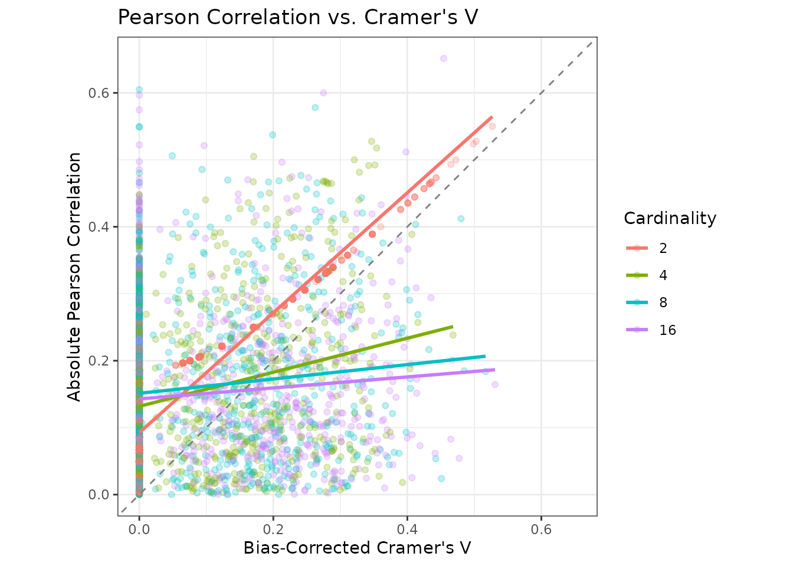

# Unified Correlation Framework

## Summary

The function
[`cor_df()`](https://blasbenito.github.io/collinear/reference/cor_df.md)
combines several methods to compute pairwise associations between
variables of different types:

- *Numeric vs. numeric*: Pearson correlation.
- *Numeric vs. categorical*: Combines target encoding and Pearson
  correlation.
- *Categorical vs. categorical*: Bias-corrected Cramer’s V.

This article provides fine-grained details on this functionality and
describes the caveats of combining Pearson correlation and Cramer’s V
when the cardinality of categorical predictors is high.

## Setup

This article requires the following setup Don’t miss the object
`predictors` and the variables it contains, as most of the explanatory
code herein will be focusing on these.

## Understanding `cor_df()`

This section explains in detail how
[`cor_df()`](https://blasbenito.github.io/collinear/reference/cor_df.md)
handles the computation of associations between different variable
types.

When we apply
[`cor_df()`](https://blasbenito.github.io/collinear/reference/cor_df.md)
to a dataframe and a vector of predictors, it returns a dataframe with
the Pearson or Cramer’s V association between all unique pairs of
predictors.

``` r
x <- collinear::cor_df(
  df = vi_smol,
  predictors = predictors,
  quiet = TRUE
)

x
#>                  x             y correlation     metric
#> 1 temperature_mean   koppen_zone   0.9283292    Pearson
#> 2    rainfall_mean   koppen_zone   0.8443112    Pearson
#> 3    rainfall_mean     soil_type   0.6741559    Pearson
#> 4 temperature_mean     soil_type   0.6406734    Pearson
#> 5      koppen_zone     soil_type   0.3146128 Cramer's V
#> 6 temperature_mean rainfall_mean   0.2126887    Pearson
```

Let’s examine how the function handles different predictor types.

### Numeric vs. Numeric

This is the simplest and most reliable case
[`cor_df()`](https://blasbenito.github.io/collinear/reference/cor_df.md)
handles, as pairwise Pearson correlations are computed with the very
fast [`stats::cor()`](https://rdrr.io/r/stats/cor.html).

The parallelization setup is ignored in this case.

``` r
predictors_numeric <- collinear::identify_numeric_variables(
  df = vi_smol,
  predictors = predictors
)$valid

stats::cor(
  x = vi_smol[, predictors_numeric],
  use = "complete.obs",
  method = "pearson"
) |> 
  abs()
#>                  temperature_mean rainfall_mean
#> temperature_mean        1.0000000     0.2126887
#> rainfall_mean           0.2126887     1.0000000
```

### Numeric vs. Categorical

To handle this situation,
[`cor_df()`](https://blasbenito.github.io/collinear/reference/cor_df.md)
first applies target encoding to the categorical predictor using the
numeric variable as reference, then applies
[`stats::cor()`](https://rdrr.io/r/stats/cor.html) to compute the
Pearson correlation.

``` r
#transform koppen_zone to numeric
df <- target_encoding_lab(
  df = vi_smol,
  response = "temperature_mean",
  predictors = "koppen_zone",
  encoding_method = "loo",
  overwrite = TRUE,
  quiet = TRUE
)

stats::cor(
  x = df[["temperature_mean"]],
  y = df[["koppen_zone"]],
  use = "complete.obs",
  method = "pearson"
) |>
  abs()
#> [1] 0.9283292
```

### Categorical vs. Categorical

This case is solved via bias-corrected [Cramer’s
V](https://en.wikipedia.org/wiki/Cram%C3%A9r%27s_V), based on Pearson’s
chi-squared statistic. This method is implemented in the function
[`cor_cramer()`](https://blasbenito.github.io/collinear/reference/cor_cramer.md).

``` r
collinear::cor_cramer(
  x = vi_smol[["koppen_zone"]],
  y = vi_smol[["soil_type"]]
)
#> [1] 0.3146128
```

### Comparing Cramer’s V and Pearson Correlation

Now that you know how
[`cor_df()`](https://blasbenito.github.io/collinear/reference/cor_df.md)
handles different cases, there is an important question to answer: *Are
Cramer’s V and Pearson correlation comparable?*

Let’s try to answer that question empirically with a small simulation.
It generates integer vectors with different cardinality levels and
compares them using both
[`stats::cor()`](https://rdrr.io/r/stats/cor.html) and
[`cor_cramer()`](https://blasbenito.github.io/collinear/reference/cor_cramer.md).

``` r
set.seed(1)

#simulation parameters
sim <- data.frame(
  classes = rep(x = c(2, 4, 8, 16), times = 1000),
  cor = NA_real_,
  cramer_v = NA_real_
)

#run simulation
for(i in seq_len(nrow(sim))) {
  
  #generate integer vector with n classes
  x <- sample(x = 1:sim$classes[i], size = 30, replace = TRUE)
  
  #reshuffle x to get y with same marginal distribution
  y <- sample(x)
  
  #compute absolute Pearson correlation
  sim$cor[i] <- abs(stats::cor(x, y))
  
  #compute Cramer's V
  sim$cramer_v[i] <- collinear::cor_cramer(x, y)
  
}
```

The scatterplot below shows the simulation results across cardinality
levels, with linear smooths for each group.



Notice how the relationship between Cramer’s V and Pearson correlation
is tight for binary variables, but deteriorates rapidly as cardinality
increases.

Moreover, Cramer’s V tends to produce smaller values than Pearson’s
correlation. This creates a systematic bias favoring categorical
predictors in multicollinearity analysis when the two measures are
compared directly.

To make users aware of this issue, the function returns either a message
or a warning.

The message appears when there are at least two categorical and one
numeric predictor and `quiet = FALSE`.

``` r
x <- collinear::cor_df(
  df = vi_smol,
  predictors = predictors,
  quiet = FALSE
)
#> 
#> collinear::cor_df(): 2 categorical predictors have cardinality > 2 and may bias the multicollinearity analysis. Applying target encoding to convert them to numeric will solve this issue.
```

The warning appears when `quiet = TRUE`.

``` r
x <- collinear::cor_df(
  df = vi_smol,
  predictors = predictors,
  quiet = TRUE
)
#> Warning: 
#> collinear::cor_df(): 2 categorical predictors have cardinality > 2 and may bias the multicollinearity analysis. Applying target encoding to convert them to numeric will solve this issue.
```

## Recommendations

Based on the analysis above, here are practical recommendations:

1.  **For numeric predictors only**: Use
    [`cor_df()`](https://blasbenito.github.io/collinear/reference/cor_df.md)
    without concerns, as this represents the best-case scenario.

2.  **For mixed predictors with low-cardinality categoricals**:
    [`cor_df()`](https://blasbenito.github.io/collinear/reference/cor_df.md)
    works well as-is, though be aware of slight underestimation in
    Cramer’s V values.

3.  **For high-cardinality categoricals**:

    - Consider using
      [`target_encoding_lab()`](https://blasbenito.github.io/collinear/reference/target_encoding_lab.md)
      to convert them to numeric before analysis.
    - Alternatively, use
      [`collinear()`](https://blasbenito.github.io/collinear/reference/collinear.md)
      with `encoding_method = "loo"`, which handles this automatically.
    - This provides more reliable multicollinearity assessment.
